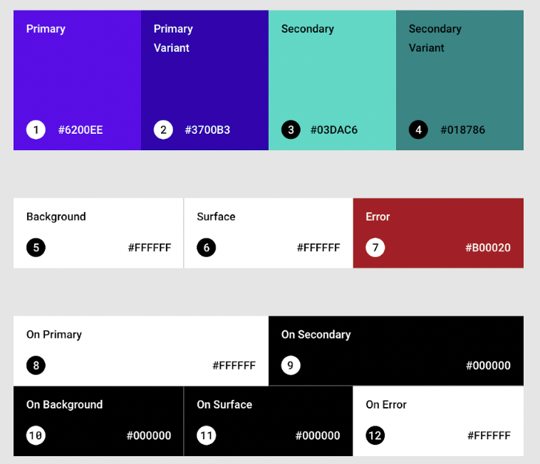

# Android App Schritt-für-Schritt Anleitung

In dieser Woche bauen wir gemeinsam eine Vorlage für eine saubere und professionelle Android App,
die alle Themen beinhaltet die wir bisher behandelt haben. Gehe dazu durch die folgenden Themen
durch und behandele sie **in einer Reihenfolge die dir sinnvoll erscheint**. Denke daran möglichst
kleinschrittig zu arbeiten und zwischendurch immer wieder ausgiebig zu testen!

## **Navigation mit Fragmenten**

### **Gradle Dependencies**

- Füge die notwendigen Dependencies für Navigation in deiner `build.gradle` Datei hinzu.

### **NavHostFragment**

- Füge das `NavHostFragment` in das Layout deiner MainActivity ein.
- Setze die benötigten XML Attribute(name, defaultNavHost, nav_graph)

### **Zwei Fragmente**

- Erstelle mindestens zwei Fragmente, zwischen denen du navigieren kannst.

### **Nav_graph**

- Erstelle eine `nav_graph.xml` Datei unter `res/navigation`.
- Füge deine Fragmente ein.
- Richte Parameter und Actions ein(Verbindungen zwischen den Fragmenten)

### **Bottom Nav (optional)**

- Füge eine `BottomNavigationView` hinzu und verknüpfe sie mit deinem `nav_graph` über
  ein `nav_menu`.

## **RecyclerView**

### **List_item Layout**

- Erstelle ein Layout für die einzelnen Listenelemente.

### **RecyclerView im Fragment**

- Füge den `RecyclerView` in das Layout deines Fragments ein.
- Setze die benötigten XML Attribute(layoutManager, list_item)

### **Adapter**

- Erstelle einen Adapter, der deine Daten im `RecyclerView` anzeigt.
- Implementiere die Methoden des Adapters, angepasst auf deine Daten und Layout.

### **ListAdapter (optional)**

- Für eine einfachere Datenaktualisierung kannst du den `ListAdapter` nutzen.

## **API Call**

### **Permission im Manifest**

- Füge die benötigte Internet-Permission in deine `AndroidManifest.xml` ein.

### **Datenklassen**

- Definiere Datenklassen basierend auf der Antwort deiner API.

### **ApiService**

- Erstelle einen Service, der Retrofit nutzt, um API Calls zu tätigen.
- Der ApiService enthält ein interface, wo alle API Calls definiert werden.
- Verknüpfe deinen ApiService mit dem Repository.
- Verknüpfe dein Repository mit dem ViewModel und teste die Funktionalität

### **Caching in Datenbank (optional)**

- Cache die API-Antwort in deiner Datenbank.

### **"Like" Funktion (optional)**

- Füge eine Funktion hinzu, mit der Nutzer Einträge "liken" können.
- Erweitere dazu die Datenklasse um ein neues Attribut und überlege dir wie du dieses verwalten
  kannst
- (Am besten in Kombination mit Datenbank)

### **Andere APIs probieren (optional)**

- Experimentiere mit verschiedenen APIs, um unterschiedliche Datenstrukturen zu sehen.

## **Datenbank**

### **Entity Datenklasse**

- Definiere Datenklassen mit den entsprechenden Annotations für Room.

### **DAO**

- Erstelle ein DAO und definiere alle Datenbankzugriffe die du benötigst als Methoden mit
  entsprechenden Annotations.
- Mache dir Gedanken ob du alle **CRUD**-Funktionen benötigst(Create/Insert, Read/Get, Update,
  Delete)

### **Database Klasse**

- Lege die Database Klasse an und richte die getDatabase Funktion ein.
- Binde die Datenbank im Repository an.
- Verknüpfe dein Repository mit dem ViewModel und teste die Funktionalität

## **Sonstiges**

Für ein professionelles Auftreten braucht deine App noch einige Details.

### **View Binding**

- Aktiviere View Binding in der Projekt gradle Datei
- Nutze ViewBinding in allen Fragmenten und der MainActivity um auf das Layout zuzugreifen

### **String Lokalisierung**

- Füge deine Strings in der `res/values/strings.xml` Datei hinzu.
- Greife im Code auf die `strings.xml` zu anstatt statische Strings zu benutzen
- Füge eine oder mehrere andere Sprachen hinzu indem du alternative strings.xml erstellst

### **Gradient als Hintergrund**

- Erstelle eine `drawable` XML-Datei für den Gradienten.
- Setze diesen Gradienten als Hintergrund für deine Activities oder Fragmente.

### **Night Mode**

- Definiere Farben für den Nachtmodus unter `res/values-night`.
- Überschreibe die theme Farben die in Android standardmäßig definiert sind und nutze diese in
  deiner App
  

### **App Icon**

- Nutze den Resource Manager um deiner App ein eigenes Icon zu geben.

### **Landscape Layout**

- Erstelle für deine Layouts alternative Versionen im landscape Format.
- Erstelle dazu ein neues Layout Resource File mit gleichem Namen, wähle den Qualifier 'Orientation'
  aus und setze ihn auf 'Landscape'

---

Viel Erfolg beim Erstellen deiner App!